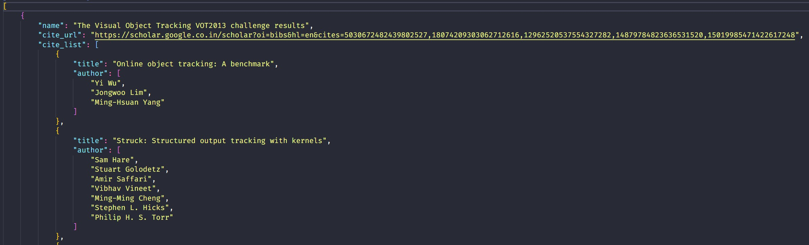
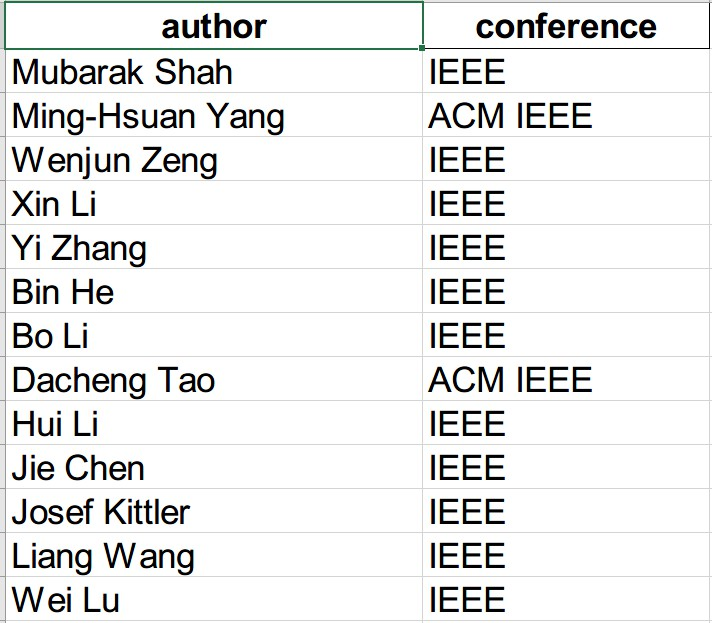
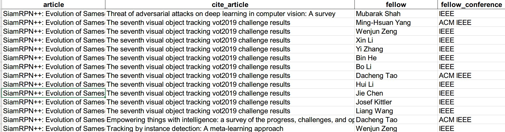

# gs-cite-fellow

This project is used to find all Fellows who have cited the scholar's article. 

### Process

1. Crawl the scholar's Google Scholar home page for all articles published by the scholar, and the Google Scholar citation link for each article.
2. Crawl the title of each cited article in the Google Scholar citation  link for each article.
3. Clean the titles of the crawled articles. 
4. Crawl the author name of each cited article in parallel in DBLP.
5. Merge the parallel crawl results in DBLP.
6. Crawl or get the list of Fellows directly.
7. Clean the Fellow list. 
8. Compare the author names of each cited article with the Fellow list and output the final result.

### Some Questions

* Same name. The cited author and the fellow author have the same name. 
* Inconsistent correspondence between article and author. Some articles is not included by DBLP.
* Incomplete fellow list.
* Google Scholar only shows 1000 cited papers results

So the results are still relatively inaccurate, and need to be checked one by one.

## Installation

```
pip install -r requirements.txt
```

## Configuration

Add the following to ``config.json``.

* ``scholar_id``. The scholar's Google Scholar Id, which can be found in the URL of the scholar's Google Scholar home page.
* ``driver_path``. The address of the Google Chrome driver, which must be the same version as Google Chrome. It can be downloaded from the internet.

## Run the code

``` bash
# 01  
python 01_article.py

# 02 
# Start_article id is the start number of the crawled article. 
# You need to manually validate the code during the crawl
pythn 02_citation.py {{start_article id}}

# 03 
pythn 03_clear.py 

# 04 
# Parallel_count is the total number of parallelism, 8 is recommended. 
# Parallel_id is the parallelism id
# If parallel_count is 8, you need to start 8 processes, respectively python 04_author.py {{0..7}} 8
pythn 04_author.py {{parallel_id}} {{parallel_count}}


# 05
# parallel_count is the total number of parallelism, consistent with 04.
python 05_merge.py {{parallel_count}}

# 08 
python 08_compare_fellow.py

```

## Results

* ``articles.json``: All articles published by scholars and all cited articles,



* ``fellow.xls``: A list of all the fellows who have cited the scholars' articles.



* ``result.xls``: Specific information about scholar articles cited by fellow.



